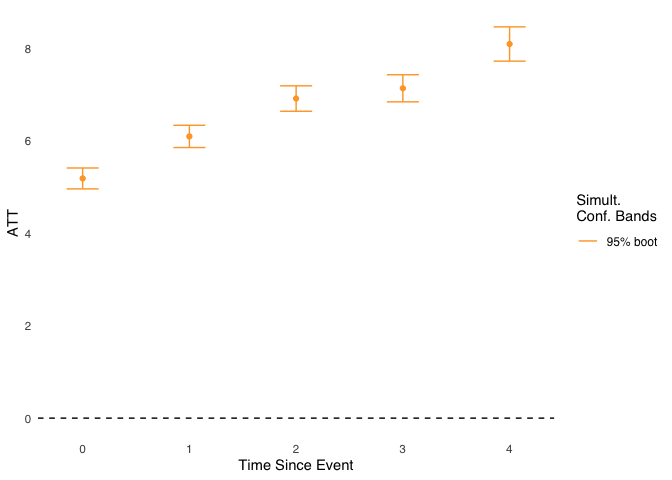
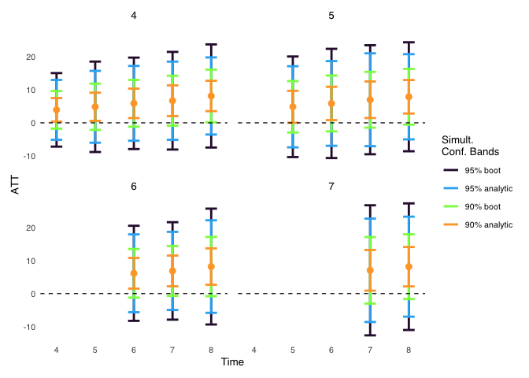

# edid

The {edid} package implements the efficient difference-in-differences
and event study estimators developed by [Chen, Sant’Anna, and Xie
(2025)](https://arxiv.org/abs/2506.17729). I initially developed the
code for a personal project, so the functionality is limited. I describe
the limitations below. It also has several dependencies, though almost
all are {tidyverse} packages. I imagine a more robust implementation
will be released, but as far as I am aware, this is currently the only
publicly available software for this class of estimators. I am happy to
expand the functionality so please feel free to submit requests!

## Installation

Install the package from this GitHub page by running the code below in
R.

``` r
# install.packages("pak")
pak::pak("david-loeb/edid")
```

## Overview

The package contains a series of functions designed to be run
sequentially, beginning with data setup and ending with a data frame of
results. The function `edid()` executes the entire process by running
each of these functions under the hood. This is the most straightforward
way to use the package. `edid()` requires the following set of
arguments:

- Dataset
- Names of four variables in the dataset
  - `y_var`: The outcome variable
  - `treat_time_var`: A variable that specifies the time period in which
    each unit adopted the treatment; never treated units get a `0` on
    this variable
  - `id_var`: A unique identifier for each unit
  - `time_var`: The time variable
- `num_t_pre`: The number of pre-treatment periods to use for ATT
  estimation

The code below demonstrates how to use `edid()`.

``` r
library(edid)

edid_results <- edid(
  edid_ex_data,
  y_var = "outcome",
  treat_time_var = "treat_adopt_time",
  id_var = "id",
  time_var = "time",
  num_t_pre = 3
)
```

The result will be a data frame with the efficient $ATT(g,t)$, event
study, and calendar time aggregation results. You can also request a
more complete set of model components, including the individual
$ATT(g,t)$ and weights used to compute the efficient $ATT(g,t)$ by
setting `get_full_mod = TRUE` in the `edid()` function. Additional
options can be specified in `edid()` such as anticipation periods; see
the documentation for details.

## Plot results

The EDiD results can be plotted with the `plot_edid()` function. It uses
{ggplot2} (and {patchwork} if plotting individual $ATT(g,t)$ ) under the
hood. The following code demonstrates how to use `plot_edid()` and an
example of the resulting plot. (Wouldn’t we all love to have results
like this?)

``` r
# Event study plot
plot_edid(edid_results, type = "es")
```



The plots can be customized in a number of ways, including the
confidence intervals to plot, color scheme, titles, point and line
sizes, text sizes, font, and whether to display the legend. You can also
save the plot result and customize it further with your own {ggplot2}
pipeline. The plot below shows the full set of $ATT(g,t)$ results and
all confidence intervals with some appearance customizations. (I
increase the confidence interval size in the example to provide a more
demonstrative plot.)

``` r
# Increase the size of CIs
edid_res_larger_CI <- edid_results |> 
  dplyr::mutate(
    ci_up_95_boot = ci_up_95_boot + se_boot * 100,
    ci_up_90_boot = ci_up_90_boot + se_boot * 50,
    ci_up_95_analytic = ci_up_95_analytic + se_analytic * 80,
    ci_up_90_analytic = ci_up_90_analytic + se_analytic * 30,
    ci_low_95_boot = ci_low_95_boot - se_boot * 100,
    ci_low_90_boot = ci_low_90_boot - se_boot * 50,
    ci_low_95_analytic = ci_low_95_analytic - se_analytic * 80,
    ci_low_90_analytic = ci_low_90_analytic - se_analytic * 30
  )

plot_edid(
  edid_res_larger_CI, 
  type = "attgt", 
  ci = "all", 
  point_size = 2.5,
  error_bar_vline_width = 1,
  text_size_base = 10
)
```



See the `plot_edid()` documentation for more details on the various
plotting options.

## Full set of package functions

A list of all the package functions with a brief description of each is
below. See the package documentation for a detailed explanation of each
function. The functions are run in the order listed to execute the
modeling process.

- `prep_data()`: Takes a panel dataset and converts it to the proper
  format for the modeling functions.
- `get_ytilde()`: Returns the $\tilde{Y}_{g',t\_{pre}}^{att(g,t)}$
  values for each unit.
- `get_influence_func()`: Returns the influence function values for each
  unit.
- `estimate_model()`: Estimates the efficient $ATT(g,t)$, standard
  errors, and confidence intervals.
- `get_results_attgt()`: Extracts the efficient $ATT(g,t)$ and related
  results into a data frame.
- `get_results_agg()`: Aggregates the results into event study and/or
  calendar time effects and returns the results in a data frame.
- `edid()`: Runs all of the above functions and returns any or all of
  the results of the three previous functions.
- `plot_edid()`: Plots the results with {ggplot2}.

## Limitations

{edid}’s biggest limitation is that it does not handle covariates. It
also requires that all treatment groups use the same number of
pre-treatment periods to estimate treatment effects, and it requires
balanced panels. I am definitely open to expanding the functionality so
don’t hesitate to reach out with requests / issues / feedback of any
kind.

## Acknowledgements

First I would like to thank the authors Drs. Xiaohong Chen, Pedro H. C.
Sant’Anna, and Haitian Xie for their fantastic work developing this
estimator. It has already proved useful in my own work. I highly
recommend reading [their paper](https://arxiv.org/abs/2506.17729). I
also want to thank Dr. Brantly Callaway (and Dr. Pedro Sant’Anna again)
for the multiplier bootstrap procedure developed in their renowned [2021
paper](https://www.sciencedirect.com/science/article/abs/pii/S0304407620303948)
“Difference-in-Differences With Multiple Time Periods.” I used not only
the procedure but much of the code directly from their implementation in
the [{did} package](https://bcallaway11.github.io/did/).
